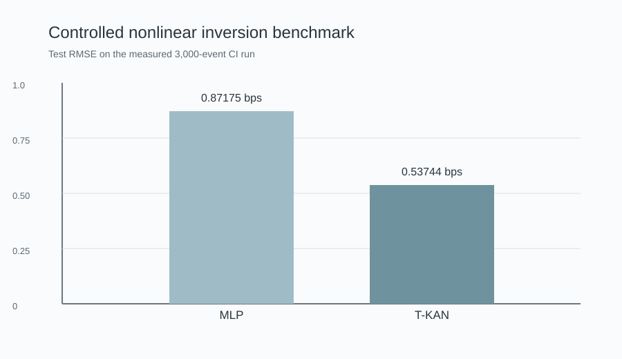
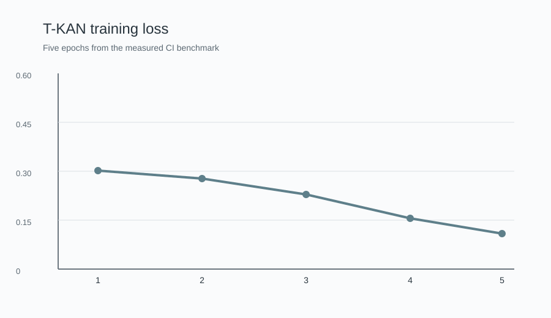
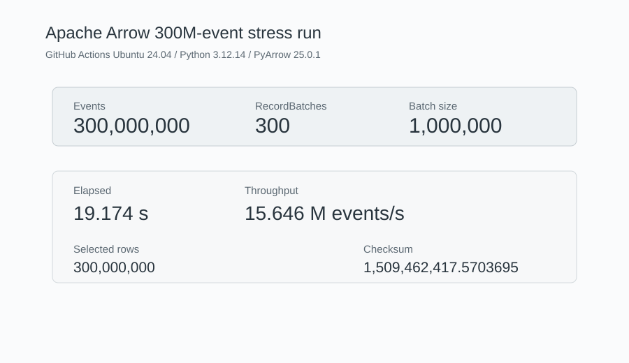
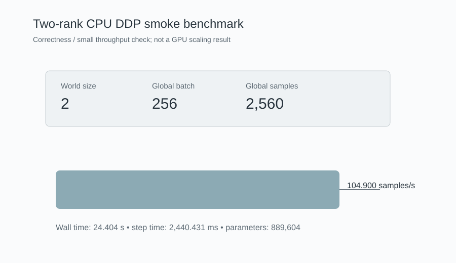
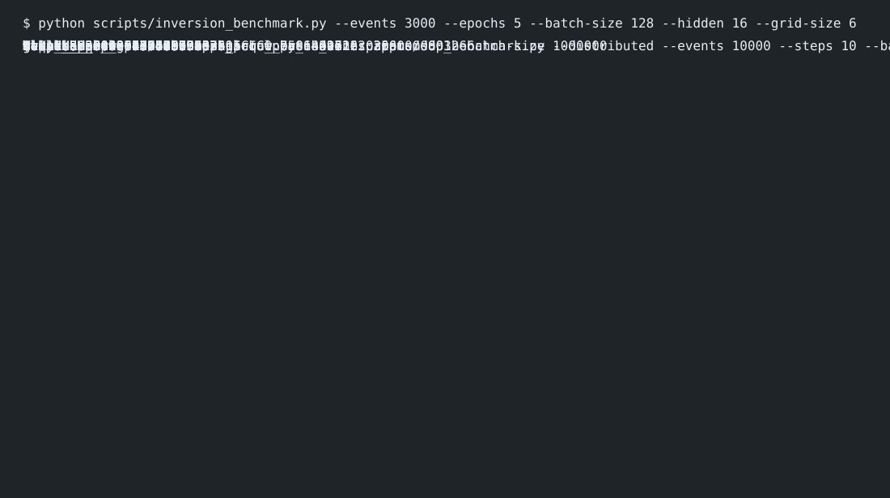

# T-KAN Microstructure Engine


A compact research implementation for modelling event-level limit-order-book microstructure with a Temporal Kolmogorov-Arnold Network (T-KAN), a streaming Apache Arrow data path, and PyTorch DistributedDataParallel support.

The repository is designed to be runnable from a clean checkout. The default examples use deterministic synthetic data so that the model and data pipeline can be tested without a proprietary market-data feed.

## What is in the repository

The project has four main parts.

| Area | Implementation |
|---|---|
| Nonlinear sequence model | B-spline KAN edge activations with adaptive grids and a causal depthwise temporal mixer |
| LOB feature path | Spread, queue imbalance, microprice displacement, signed trade, ten level-wise depth imbalance and midpoint return |
| Columnar data path | Apache Arrow RecordBatch processing, q-like filter/select/within/group helpers and Parquet dataset scanning |
| Distributed training | PyTorch DDP, DistributedSampler, CUDA AMP, fused AdamW when supported, gradient clipping and synchronized KAN grid state |

The source code is under `src/tkan_engine`. Command-line entry points used in the examples are under `scripts/`.

## Results

The values below are measured outputs from the repository's GitHub Actions run 22 on the branch used for this project. The benchmark environment was Ubuntu 24.04 with Python 3.12.14, PyTorch 2.14.1 and Apache Arrow 25.0.1.

### Controlled nonlinear inversion

This benchmark generates a known nonlinear response from order-flow features and compares a small MLP against the T-KAN encoder. It is deliberately a controlled representation-learning experiment; it is not exchange replay data and it is not a trading-alpha study.

Configuration:

- 3,000 synthetic observations
- sequence length 16
- chronological 80/20 split
- 5 epochs
- batch size 128
- hidden dimension 16
- T-KAN spline grid size 6

| Model | Parameters | Test MSE (bps²) | Test RMSE (bps) | Test IC |
|---|---:|---:|---:|---:|
| MLP | 801 | 0.75995 | 0.87175 | 0.75018 |
| T-KAN | 3,266 | 0.28884 | 0.53744 | 0.86401 |





The exact CI JSON is stored in `results/ci_inversion_3000.json`.

### 300M-event Arrow stress run

The Arrow path processes one RecordBatch at a time. The run below used a one-million-row batch size and completed without constructing a 300M-row in-memory table.

| Metric | Measured value |
|---|---:|
| Events | 300,000,000 |
| RecordBatches | 300 |
| Elapsed time | 19.174 s |
| Throughput | 15,645,869 events/s |
| Selected rows | 300,000,000 |
| Checksum | 1,509,462,417.5703695 |



The exact run is stored in `results/arrow_benchmark_300m.json`.

### 2-rank CPU DDP smoke benchmark

This is a distributed correctness and small throughput smoke test, not a GPU scaling result.

| Metric | Measured value |
|---|---:|
| World size | 2 |
| Device | CPU |
| Global batch size | 256 |
| Steps | 10 |
| Global samples | 2,560 |
| Wall time | 24.404 s |
| Throughput | 104.900 samples/s |
| Parameters | 889,604 |



The exact run is stored in `results/ddp_benchmark_cpu.json`.

### CI execution snapshot

The following image is a rendering of the actual benchmark output captured from the same CI run.



## Installation

The verified Python range in CI is 3.10, 3.11 and 3.12.

### Linux / macOS

```bash
git clone https://github.com/SpryzenHell/tkan_engine.git
cd tkan_engine

python3.12 -m venv .venv
source .venv/bin/activate

python -m pip install --upgrade pip
python -m pip install -e ".[full]"
```

Use Python 3.10 or 3.11 in place of 3.12 when those are the interpreters available on the machine.

### Windows PowerShell

```powershell
git clone https://github.com/SpryzenHell/tkan_engine.git
cd tkan_engine

py -3.12 -m venv .venv
.\.venv\Scripts\Activate.ps1

python -m pip install --upgrade pip
python -m pip install -e ".[full]"
```

If the machine does not have a Python 3.12 launcher, use `py -3.10` or `py -3.11`.

The `full` extra installs the optional Arrow support and pytest. The base package only needs NumPy, pandas and PyTorch.

### GPU environments

The repository does not pin a CUDA-specific PyTorch wheel. On a CUDA machine, install the PyTorch build appropriate for that machine first, then install the project with:

```bash
python -m pip install -e ".[full]"
```

The code automatically selects CUDA when it is available. CUDA AMP and fused AdamW are enabled where the installed PyTorch build supports them. The repository never reports a GPU benchmark unless CUDA is actually present.

## Verify a fresh installation

Run the lightweight self-check first:

```bash
python scripts/self_check.py
```

A successful run prints the Python and PyTorch versions, whether CUDA and PyArrow are available, the generated LOB feature dimension, the model output shape and `Self-check: OK`.

Then run the test suite:

```bash
pytest
```

## Run the nonlinear benchmark

The benchmark used for the numbers above is:

```bash
python scripts/inversion_benchmark.py \
  --events 3000 \
  --epochs 5 \
  --batch-size 128 \
  --hidden 16 \
  --grid-size 6
```

It writes `results/inversion_benchmark.json`.

The benchmark target is generated by:

```
0.9*sin(2.6*OFI) + 0.55*OFI^3 + 0.25*dOFI + N(0, 0.08^2)
```

The split is chronological rather than random.

## Run the LOB model

The basic training path uses the deterministic ten-level LOB generator:

```bash
python scripts/train.py   --events 30000   --seq-len 64   --epochs 6   --batch-size 256   --hidden 48   --depth 2   --grid-size 8
```

The command writes `results/model_metrics.json`.

The model predicts the next midpoint return in basis points per event. The training script currently materializes the requested event window into a pandas DataFrame, so this command is intended for development-sized data rather than the 300M-event stress path.

## Run the Arrow pipeline

For a small local smoke test:

```bash
python scripts/benchmark_arrow.py --events 5000000 --batch-size 250000
```

For the full stress configuration used in CI:

```bash
python scripts/benchmark_arrow.py --events 300000000 --batch-size 1000000
```

The Arrow path requires PyArrow. It consumes RecordBatches one at a time and applies columnar operations before releasing the batch.

### Using real Parquet replay data

The Parquet scanner expects the selected columns to include:

```
ts_ns
bid_px_1
ask_px_1
bid_sz_1
ask_sz_1
```

The raw L2 Arrow path derives `mid`, `queue_imbalance` and `spread_bps` from those columns. Additional columns can be retained in the scanner when a later feature stage needs them.

Example:

```bash
python scripts/benchmark_arrow.py \
  --input /path/to/parquet/dataset \
  --batch-size 1000000
```

For a reproducible real-data benchmark, record the dataset identifier, date range, symbols, machine CPU/RAM, Python version, PyArrow version and the exact command alongside the resulting JSON. Proprietary or exchange data is intentionally not included in this repository.

## q-like operations

`src/tkan_engine/arrow_pipeline.py` provides small helpers with familiar q-style names:

- `q_where`: filter rows by an Arrow expression
- `q_select`: project a set of columns
- `q_within`: inclusive numeric range filter
- `q_by`: grouped Arrow aggregation

These helpers are thin wrappers around Apache Arrow operations rather than a q interpreter.

## Run DDP

The training code is compatible with `torchrun`.

Two-rank CPU smoke benchmark:

```bash
torchrun --standalone --nproc_per_node=2 \
  scripts/ddp_benchmark.py \
  --distributed \
  --events 10000 \
  --steps 10 \
  --batch-size 128
```

CUDA training can use the same command on a machine with multiple visible GPUs. Set `CUDA_VISIBLE_DEVICES` as needed for the target system.

The distributed training loop uses `DistributedSampler`. Adaptive KAN spline state is non-gradient state, so the updated grid and spline coefficients are explicitly broadcast after grid updates. The current design uses rank 0's sampled batch as the source of the adaptive grid; a fully distributed quantile/statistic update is left as a future optimization.

## Profile the GPU path

For a PyTorch profiler run:

```bash
python scripts/profile_gpu.py \
  --batch 256 \
  --seq-len 64 \
  --features 15 \
  --hidden 128 \
  --steps 100
```

For kernel-level arithmetic-intensity analysis, use Nsight Systems and Nsight Compute on the actual NVIDIA target machine. The repository contains the expected profiling workflow in `docs/PROFILING.md`.

No GPU performance number is stored in this repository because the available development environment did not have CUDA.

## Tests and continuous integration

GitHub Actions runs:

- pytest on Python 3.10, 3.11 and 3.12
- the 3,000-event nonlinear benchmark in each Python job
- a 5M-event Arrow smoke benchmark
- the 300M-event Arrow benchmark
- a two-rank CPU DDP smoke benchmark

The workflow cancels stale pull-request runs so that benchmark results are tied to the current branch head.

## Repository layout

```
src/tkan_engine/
    arrow_pipeline.py
    data.py
    features.py
    kan.py
    model.py
    training.py

scripts/
    benchmark_arrow.py
    benchmark_model.py
    ddp_benchmark.py
    ddp_smoke.py
    generate_demo.py
    inversion_benchmark.py
    profile_gpu.py
    self_check.py
    train.py

tests/
    test_core.py

configs/
    default.yaml

docs/
    ARCHITECTURE.md
    DATA_SCALE.md
    EXPERIMENTS.md
    PROFILING.md
    REPRODUCIBILITY.md
    BENCHMARK_STATUS.md

results/
    ci_inversion_3000.json
    inversion_benchmark.json
    arrow_benchmark_300m.json
    ddp_benchmark_cpu.json
```

## Reproducibility notes

All synthetic generators in this repository are seeded. The Arrow stress generator keeps continuity of the midpoint state across batches. The nonlinear benchmark uses a fixed NumPy seed and fixed model seeds.

The benchmark figures in this README are derived from measured command output recorded in the JSON files under `results/`. They are not illustrative values.

For a clean machine, start with `docs/REPRODUCIBILITY.md` after installation.

## Scope and limitations

This repository is a research implementation, not a production market-data system.

It does not contain exchange data, broker connectivity, order execution code, or a claim of financial performance. The 300M-event measurement is a synthetic Arrow stress test of the columnar processing path.

The Temporal KAN implementation is intended to make the nonlinear edge-function and temporal-mixing ideas concrete and testable. It is not presented as a drop-in replacement for a production KDB+/q stack.

## Third-party source and attribution

The project was informed by the supplied upstream repositories:

- `Blealtan/efficient-kan`
- `letianzj/QuantResearch`
- `jdb78/pytorch-forecasting`, which GitHub currently resolves to `sktime/pytorch-forecasting`

The exact inspected commit SHAs, licenses and attribution boundaries are recorded in `THIRD_PARTY_NOTICES.md`.

